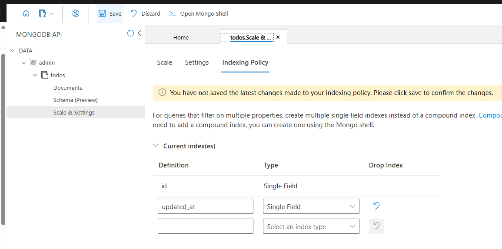
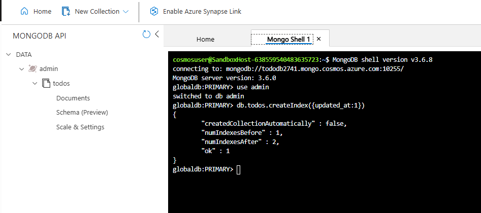

# Lab 01 - [Microservices in ACI](https://thenewstack.io/tutorial-building-deploying-microservices-application-azure-container-instances)

**NOTE: Use an A Cloud Guru (ACG) Azure Playground for this lab**

1. Login to `acloudguru.com`, navigate to the `Playground` tab, and click the `Start Azure Sandbox` button
1. Right click the `Open Sandbox` button and select to open in an Incognito or InPrivate window (depending on the browser you're using)
1. Use the provided credentials to login to the Azure portal
1. Launch `Cloud Shell` in the Azure portal
    - Use `Bash`
    - Click `No Storage Account Required`
    - For `Subscription` select the available option
    - Click `Apply`
    - In the `Cloud Shell` terminal click the `Settings` dropdown and select `Go to Classic version`; this will allow you to work with source code in the shell using `code .`
1. Configure environment variables as follows:

```
export RG=$(az group list --query [*].name --output tsv)
export LOC=$(az group list --query [*].location --output tsv)
export DB=toyshop$RANDOM
export REG=toyshop$RANDOM
```

6. Do not create a new resource group - use the one provided in the sandbox
1. Create a new ACR using `az acr create --resource-group $RG --location $LOC --sku Basic --name $REG --admin-enabled true`
1. Execute `az acr list --query [*].name` (or review in Azure Portal) to confirm creation
1. You will not be able to create a new Service Principal for your ACR (due to restrictions in ACG), so use the following as the steps instead:
    - Execute `export USR=$(az acr credential show --name $REG --query username --output tsv)` to gather username for accessing ACR into a new environment variable
    - Execute `export PASSWD=$(az acr credential show --name $REG --query passwords[0].value --output tsv)` to gather password for accessing ACR into a new environment variable
1. From `Cloud Shell`, execute `git clone https://github.com/KernelGamut32/azure_docker_microservices-public.git` to pull down the class repository
1. Navigate to the `users` microservice folder using `cd azure_docker_microservices-public/week03/labs/lab04/users`
1. Create a `Dockerfile` that can be used to generate and store an image in ACR for the `users` microservices
1. Run `az acr build --registry $REG --resource-group $RG --image users-svc:latest .` to build an image for the microservice
1. Repeat for both the `inventory` and `toyshop` microservices

1. Navigate to the project folder using `cd todo-app`
1. From `Cloud Shell` in the project folder, run `az acr build --registry $REG --resource-group $RG --image todo-app:latest .` to build an image for the TODO app from the provided Dockerfile
1. Navigate to the `Repositories` area of your ACR to confirm creation of the image
1. Use the following steps to create a new Cosmos DB (MongoDB) database:
    - Run `az cosmosdb create --name $DB --kind MongoDB  --resource-group $RG`
    - Run `export CONNSTR=$(az cosmosdb keys list --type connection-strings --resource-group $RG --name $DB --query connectionStrings[0].connectionString --output tsv)` to set a new environment variable for MongoDB Connection String
1. Use the following to create a new container in ACI for hosting the TODO app:

```
az container create \
    --name todo \
    --resource-group $RG \
    --registry-login-server $REG.azurecr.io \
    --registry-username $USR \
    --registry-password $PASSWD \
    --image $REG.azurecr.io/todo-app:latest \
    --environment-variables DBHOST="$CONNSTR" PORT=80 \
    --ip-address public \
    --port=80
```

16. Use `az container show --name todo --resource-group $RG --query ipAddress.ip --output tsv` to get public IP for the container
1. Try accessing the deployed app using `http://<public-ip-of-container>`
1. Try adding a new TODO item - the create should succeed but on attempts to list existing TODO's, the query will fail (error in indexing policy)
1. To fix, navigate to `Data Explorer` for your MongoDB running in Cosmos DB
1. You can use one of the following options to add the required indexing:
    - Expand the `todos` collection under the `admin` database, click `Scale & Settings`, and add a new index for `updated_at` (`Single Field` type); **Click Save to save the indexing configuration**:

    

    - Expand the `todos` collection under the `admin` database, click `Open Mongo Shell`, and execute the following:

    ```
    use admin
    db.todos.createIndex({updated_at:1})
    ```

    

1. Return to the app and try refreshing your view
